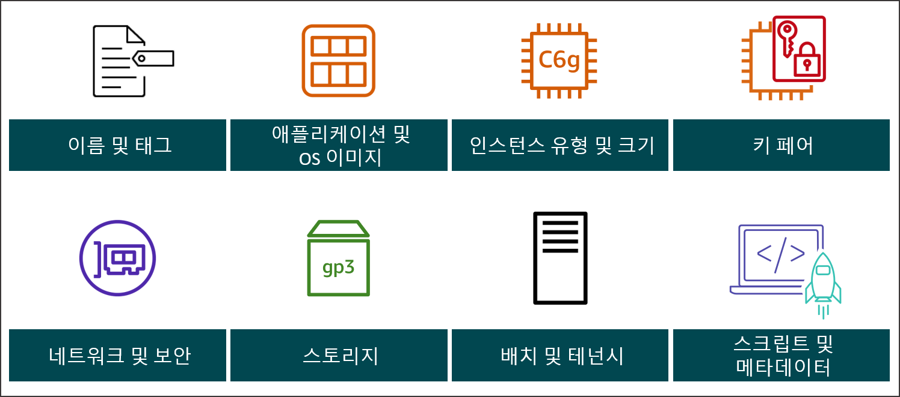
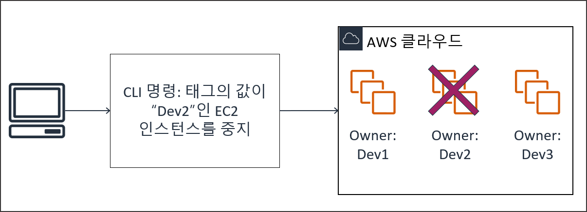
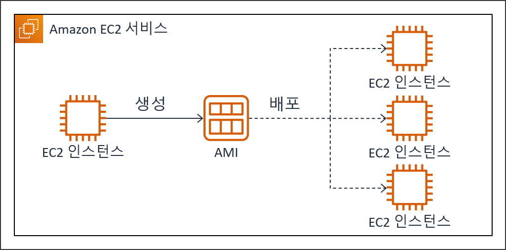
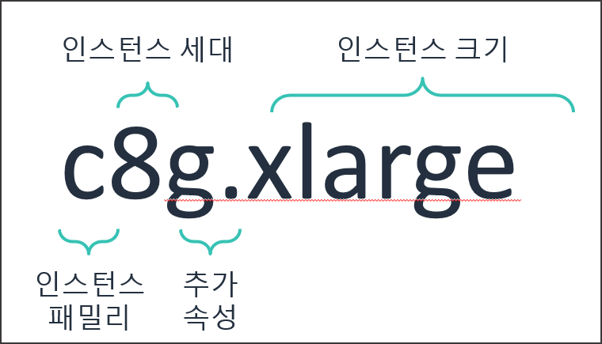
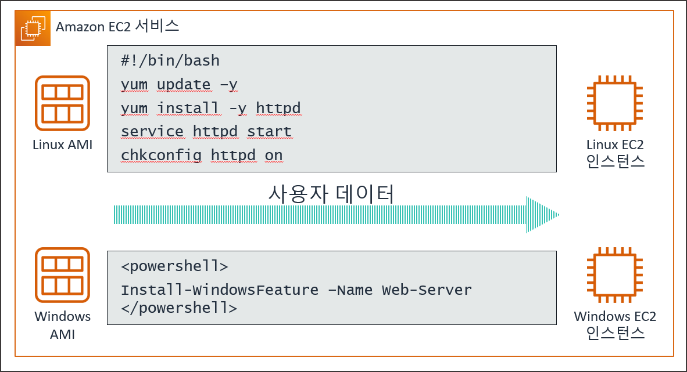
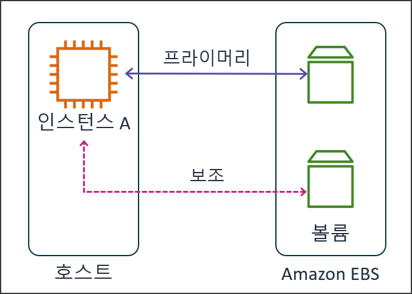
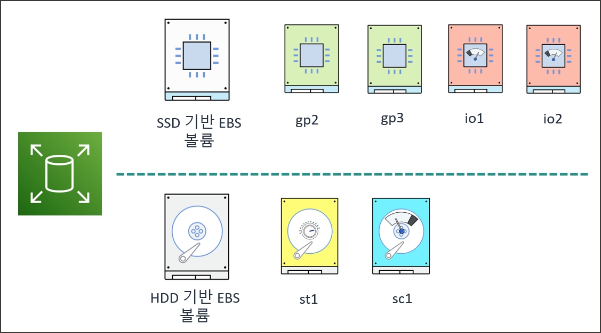
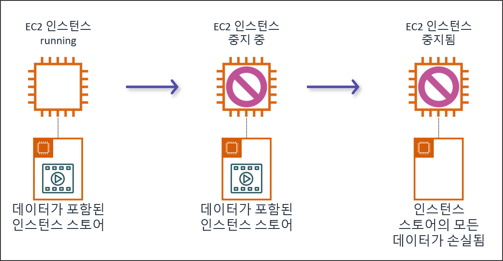
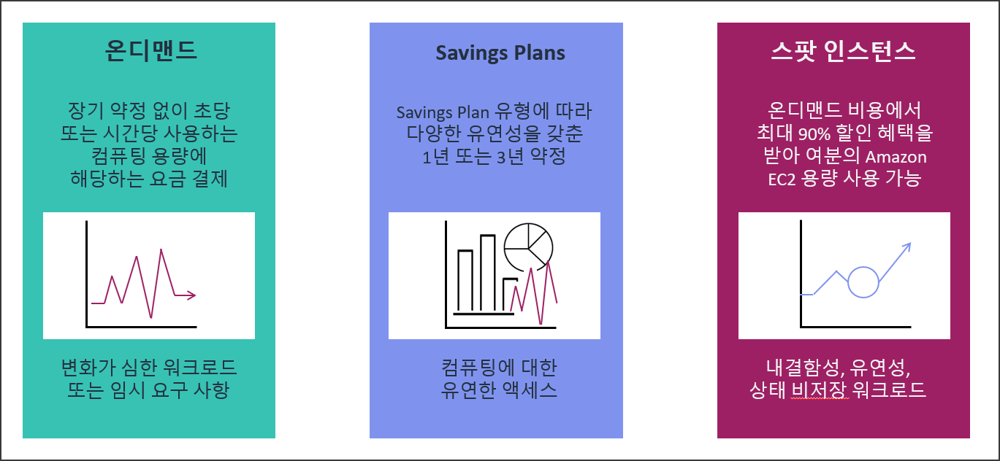

# AWS 컴퓨팅 서비스

## 학습 목표
- Amazon EC2 가상 머신(VM) 개념 및 컴퓨팅 구동 원리 이해
- 인스턴스 유형 선택 기준 및 인스턴스 네이밍 규칙 분석
- 보안 키 페어 및 사용자 데이터(User Data) 활용법 습득
- EC2 스토리지(EBS, 인스턴스 스토어) 특성 및 최적 볼륨 선택 방안 파악
- EC2 요금제 옵션(온디맨드, Savings Plans, 스팟 인스턴스) 비교 및 비용 최적화 전략 구성

## 목차
- [1. Amazon EC2 컴퓨팅 인프라 및 가상화 아키텍처](#1-amazon-ec2-컴퓨팅-인프라-및-가상화-아키텍처)
  - [1.1 EC2 인스턴스와 가상 머신(VM) 구동 원리](#11-ec2-인스턴스와-가상-머신vm-구동-원리)
  - [1.2 EC2 시작 관련 고려 사항 및 리소스 태깅](#12-ec2-시작-관련-고려-사항-및-리소스-태깅)
  - [1.3 Amazon Machine Image (AMI) 아키텍처](#13-amazon-machine-image-ami-아키텍처)
- [2. EC2 인스턴스 분류 체계 및 네트워크/배치 기술](#2-ec2-인스턴스-분류-체계-및-네트워크배치-기술)
  - [2.1 인스턴스 명명 규칙 및 패밀리 분류](#21-인스턴스-명명-규칙-및-패밀리-분류)
  - [2.2 보안 키 페어 및 네트워크 어댑터 기술](#22-보안-키-페어-및-네트워크-어댑터-기술)
  - [2.3 사용자 데이터 (User Data)](#23-사용자-데이터-user-data)
- [3. EC2 스토리지 아키텍처](#3-ec2-스토리지-아키텍처)
  - [3.1 Amazon Elastic Block Store (EBS) 세부 특성](#31-amazon-elastic-block-store-ebs-세부-특성)
  - [3.2 EBS 볼륨 세부 성능 유형 분류](#32-ebs-볼륨-세부-성능-유형-분류)
  - [3.3 인스턴스 스토어 (Instance Store) 임시 스토리지](#33-인스턴스-스토어-instance-store-임시-스토리지)
- [4. EC2 요금 모델 및 비용 최적화 전략](#4-ec2-요금-모델-및-비용-최적화-전략)
  - [4.1 온디맨드 구매 옵션](#41-온디맨드-구매-옵션)
  - [4.2 Savings Plans 약정 할인 체계](#42-savings-plans-약정-할인-체계)
  - [4.3 EC2 스팟 인스턴스 및 활용 사례](#43-ec2-스팟-인스턴스-및-활용-사례)
  - [4.4 비용 최적화를 위한 구매 옵션 조합 전략](#44-비용-최적화를-위한-구매-옵션-조합-전략)

---

# 1. Amazon EC2 컴퓨팅 인프라 및 가상화 아키텍처

## 1.1 EC2 인스턴스와 가상 머신(VM) 구동 원리

### 1.1.1 Amazon EC2 개요
- Amazon Elastic Compute Cloud (EC2)는 AWS 클라우드 데이터 센터의 물리적 서버 위에서 구동되는 가상 서버 컴퓨팅 서비스.
- 인터넷 망을 통해 필요한 시점에 수 초 내로 컴퓨터 서버를 만들고, 필요 없을 때 즉시 해제 가능한 탄력적 자원 조달 구조 제공.

### 1.1.2 가상 머신 (Virtual Machine, VM)의 구동 원리
- 가상 머신 [^11] (Virtual Machine)은 하나의 거대한 물리적 컴퓨터 하드웨어 자원(CPU, 메모리, 디스크, 네트워크)을 여러 개의 독립된 가상 컴퓨터 조각으로 나누어 실행하는 기술.
- 독자적인 컴퓨터 운영체제(Linux, Windows 등)와 소프트웨어를 마치 독립된 전용 컴퓨터에서 실행하듯이 독립 구동.
- 물리 컴퓨터 1대의 성능이 매우 강력할 때 이를 여러 컴퓨터로 나누어 사용하여 하드웨어 자원 낭비 최소화.

### 1.1.3 물리 서버와 가상 머신(VM)의 자원 분할 방식
- CPU 및 메모리 분할: 예를 들어, 물리 서버가 가지고 있는 CPU 코어가 64개이고 256GB 메모리를 가지고 있다면 가상 머신마다 A 가상머신(2코어, 8GB), B 가상머신(4코어, 16GB) 형태로 쪼개어 독립 배치.
- 보안 및 환경 격리: A 가상 머신 내부에서 장애나 악성코드가 발생하더라도, 독립된 가상 공간에 존재하는 B 가상 머신에는 아무런 영향을 주지 않는 완전한 환경 격리 제공.
- 이미지 기반 복제 및 이동성: 가상 머신은 상태 전체가 소프트웨어 파일 형태로 저장되므로, 필요에 따라 인스턴스 복제, 백업 및 다른 물리 장비로의 신속한 이동 용이.

## 1.2 EC2 시작 관련 고려 사항 및 리소스 태깅

### 1.2.1 인스턴스 프로비저닝 시 주요 설정 파라미터
- 인스턴스 식별 명칭 및 태그 설정
- 애플리케이션 실행 환경 결정을 위한 운영체제 및 AMI 선택
- 연산 작업량 요구조건에 맞는 인스턴스 패밀리 및 크기 지정
- 원격 보안 접속을 위한 인증 키 페어
- 인프라 격리 및 방화벽 통제를 위한 VPC, 서브넷, 보안 그룹 지정
- 데이터 영구 보존을 위한 블록 스토리지 타입 및 용량 구성
- 고가용성 배치를 위한 테넌시 및 배치 그룹 옵션
- 부팅 시 초기 구동을 자동화하는 사용자 데이터 스크립트

### 1.2.2 AWS 리소스 태그 관리
- 리소스 태그는 사용자 정의 Key-Value 페어 형태의 메타데이터 [^11] (Metadata) 레이블.
- 대소문자를 구분함.
- 주요 활용 분야:
  - 리소스 필터링(필터링된 리소스 일괄 중지, 삭제 등의 작업을 한번에 처리)
  - 조직 내 부서, 개발/검증/운영(Dev/Test/Prod) 환경 구분 및 소유자 추적
  - 리소스 접근 권한 제어
  - AWS Cost Explorer를 통한 비용 추적

## 1.3 Amazon Machine Image (AMI) 아키텍처

### 1.3.1 AMI 구성 요소
- 루트 볼륨 템플릿: 운영체제(OS), 애플리케이션 서버 및 초기 설치 소프트웨어가 포함된 디바이스 이미지.
- 시작 권한 (Launch Permission): 퍼블릭 공개, 지정 계정 대상 명시적 부여, 생성자 전용 암묵적 부여로 구분되는 실행 액세스 제어.
- 블록 디바이스 매핑 (Block Device Mapping): 인스턴스 생성 시 연결되는 볼륨 매핑 정보.

### 1.3.2 AMI 획득 및 생성 경로
- AWS 제공 Quick Start AMI: Amazon Linux 2023, Ubuntu Server, Red Hat, Windows Server 등 표준 검증 이미지.
- AWS Marketplace: 서드파티 소프트웨어 벤더가 사전 설치하여 배포하는 오픈소스 및 상용 솔루션 이미지.
- AWS 사용자 커뮤니티 AMI (Community AMI): 일반 AWS 사용자 및 커뮤니티 개발자들이 제작하여 공개 공유하는 이미지.
- 사용자 지정 AMI (Custom AMI): 기존 구동 중인 EC2 인스턴스를 커스텀 설정한 후 이미지 추출을 통해 자체 템플릿화 처리.

---

# 2. EC2 인스턴스 분류 체계 및 네트워크/배치 기술

## 2.1 인스턴스 명명 규칙 및 패밀리 분류

### 2.1.1 인스턴스 식별자 구성 체계
- 인스턴스 타입 명명 예시 (c8g.xlarge):
  - c: 인스턴스 패밀리 (Compute Optimized)
  - 8: 하드웨어 세대 번호 (Generation 8)
    - 최신 세대일수록 전반적으로 컴퓨팅 용량은 증가하면서 비용은 감소됨(가성비 좋음)
  - g: 프로세서 및 특수 하드웨어 속성 (AWS Graviton2 ARM 프로세서)
  - xlarge: 가상 CPU 및 메모리 배정 크기 (vCPU 4개, 메모리 8GB)
- 인스턴스 크기(Size) 및 자원 배정 예시:
  - medium 규격: vCPU 1개 할당
  - xlarge 규격: vCPU 4개 할당 (예: c8g.xlarge는 vCPU 4개, 메모리 8GB)
  - t 계열 버스트 특성: nano부터 large 크기까지는 vCPU 2개 동일 할당이며, 메모리는 0.5GB부터 8GB 범위로 구성
  - 인스턴스 크기 라인업: nano, micro, small, medium, large, xlarge, 2xlarge 및 최대 112xlarge 크기까지 세분화 제공
- 인스턴스 유형별 자세한 스펙은 EC2 콘솔의 `인스턴스 유형` 메뉴에서 확인 가능

### 2.1.2 주요 속성 기호 의미
- n: 고성능 대역폭 네트워킹 강화 모델 (Network Enhanced)
- d: 호스트 직결 로컬 인스턴스 스토어 NVMe/SSD 디스크 포함 (Direct Local Disk)
- a: AMD EPYC 프로세서 탑재 모델
- g: AWS에서 개발한 ARM 아키텍처 기반 Graviton 프로세서 탑재 모델

### 2.1.3 인스턴스 주요 패밀리 유형

| 패밀리 구분 | 대표 계열 | vCPU 대 메모리 비율 | 주요 권장 워크로드 |
| :--- | :--- | :--- | :--- |
| 범용 (General Purpose) | m, t | 1 : 4 | 웹/앱 서버, 중소형 데이터베이스, 개발 환경 |
| 컴퓨팅 최적화 (Compute) | c | 1 : 2 | 미디어 트랜스코딩, 과학 모델링, 고성능 배치 연산 |
| 메모리 최적화 (Memory) | r, x, z | 1 : 8 이상 | In-Memory 데이터베이스, 웹 캐시, 대용량 분석 |
| 가속 컴퓨팅 (Accelerated) | p, g, f | GPU/FPGA 전용 | AI/ML 딥러닝 학습, 렌더링, 자율주행 시뮬레이션 |
| 스토리지 최적화 (Storage) | i, d | 고성능 로컬 I/O | NoSQL DB, Search Engine, 대규모 데이터웨어하우스 |

## 2.2 보안 키 페어 및 네트워크 어댑터 기술
- 비대칭 키 페어 인증방식으로 공개키(Public Key)는 AWS 인스턴스 내부에 자동 등록되며, 개인키(Private Key - .pem)는 사용자가 안전하게 보관.
- SSH 프로토콜 접속 시 개인키 서명 검증을 통한 보안 연결 형성.

## 2.3 사용자 데이터 (User Data) 
- 인스턴스 최초 시작 시 루트 권한으로 1회 자동 실행되는 쉘 스크립트.
- Linux 환경에서는 cloud-init 서비스가 담당하고 Windows 환경에서는 EC2Launch 서비스가 담당하여 패키지 설치 및 환경 초기화 처리.

---

# 3. EC2 스토리지 아키텍처

## 3.1 Amazon Elastic Block Store (EBS) 세부 특성

- Amazon EBS는 단일 가용 영역(AZ) 내에서 하드웨어 결함에 대비하여 자동으로 다중 복제되는 블록 수준 영구 저장소.
  - 다중 복제 작동 원리: EBS 볼륨을 생성하면 동일한 가용 영역(AZ) 내의 서로 다른 독립된 물리 하드웨어 랙 및 디스크 매체에 데이터 블록이 실시간으로 이중화 복제 저장됨.
  - 가용성 및 내구성 확보: 특정 물리 드라이브 결함이나 서버 랙 장비 장애가 발생해도 이중화 복제된 다른 디스크 자원을 통해 데이터 손실 없이 끊김 없는 지속 읽기/쓰기 서비스 유지.
- EC2 인스턴스의 수명 주기와 독립적으로 작동하여 인스턴스를 중지하거나 삭제해도 저장 데이터 보존.
- 볼륨 변경 기능을 활용하여 인스턴스 재부팅 없이 실시간으로 용량 및 IOPS [^12] (Input/Output Operations Per Second) 성능 변경 가능.
- 특정한 시점의 볼륨 상태를 Amazon S3에 백업하는 스냅샷 [^13] (Snapshot) 기능 지원.

## 3.2 EBS 볼륨 세부 성능 유형 분류

### 3.2.1 SSD 기반 볼륨 유형
- gp2 (범용 SSD): 1GB당 3 IOPS 비율 할당. 최소 100 IOPS에서 최대 16,000 IOPS 제공. 부팅 볼륨 및 개발/테스트 환경에 적합.
- gp3 (차세대 범용 SSD): 용량과 무관하게 기본 3,000 IOPS 및 125 MiB/s 처리량 보장. 용량 증가 없이 별도로 IOPS 및 처리량을 독립 변경 가능하여 비용 효율성 우수.
- io1 / io2 (프로비저닝된 IOPS SSD): 고성능 데이터베이스 트랜잭션용. io2는 99.999%에 달하는 내구성 제공.
- io2 Block Express: SAN 스토리지급 성능 제공. 1밀리초(ms) 미만의 극저 지연시간과 최대 256,000 IOPS 지원.

### 3.2.2 HDD 기반 볼륨 유형 (루트 볼륨 적용 불가)
- st1 (처리량 최적화 HDD): 초당 데이터 전송 속도(MB/s)를 중요 지표로 삼는 대용량 순차 I/O 워크로드용 (빅데이터 분석, EMR, ETL, 로그 처리).
- sc1 (콜드 HDD): 사용 빈도가 낮은 콜드 데이터를 저렴한 비용으로 마그네틱 매체에 보관하기 위한 최저 비용 스토리지.

## 3.3 인스턴스 스토어 (Instance Store) 임시 스토리지

- 인스턴스 스토어는 호스트 물리 서버에 직접 장착된 NVMe [^14] (Non-Volatile Memory Express) 또는 SSD 기반의 블록 디바이스.
- EBS 대비 월등히 빠른 극저 지연시간과 매우 높은 IOPS 수치 제공.
- 휘발성 (Ephemeral) 스토리지 특성을 지니며, 인스턴스 중지(Stop) 또는 종료(Terminate) 시 로컬 랙 장비 할당이 해제되어 내부 데이터 영구 손실.
- 임시 캐시, 메모리 버퍼, 임시 데이터 연산용 공간으로 활용 구성.

---

# 4. EC2 요금 모델 및 비용 최적화 전략

## 4.1 온디맨드 구매 옵션

- 장기 약정이나 선결제금 없이 초 단위 또는 시간 단위 사용 시간만큼 정가 요금 지불.
- 트래픽 예측이 어렵거나 중단 없이 단기적으로 테스트해야 하는 애플리케이션 환경에 유용.

## 4.2 Savings Plans 약정 할인 체계

- 1년 또는 3년 기간 동안 시간당 일정 금액(예: $10/시간) 절감 이용 약정을 체결하여 대폭적인 할인 혜택 제공.
- Compute Savings Plans: 최대 66% 할인 제공. EC2 인스턴스 패밀리, 규격, 리전, OS, 테넌시 변동은 물론 Fargate 및 Lambda 서버리스 사용량에도 할인 적용 가능.
- EC2 Instance Savings Plans: 최대 72% 할인 제공. 지정된 리전 내 특정 인스턴스 패밀리(예: 서울 리전 c6g 계열) 이용 약정 조건. 패밀리 내부 규격 크기 및 OS 변경 자유.

## 4.3 EC2 스팟 인스턴스 및 활용 사례

- AWS 데이터 센터 내부에서 사용되지 않고 남아 있는 유휴 컴퓨팅 용량을 온디맨드 요금 대비 최대 90% 할인 받아 사용하는 옵션.
- AWS에 용량이 부족해지면 2분 전 중단 알림(Interrupt Notice)을 발송한 뒤 스팟 인스턴스를 회수.
- 상태 비저장 [^15] (Stateless) 웹 서버 플릿, 대규모 렌더링, CI/CD 테스트 빌드 및 배치 분석에 적합.

## 4.4 비용 최적화를 위한 구매 옵션 조합 전략

- 워크로드의 최소 기반 용량(Base Workload): 24시간 구동되어야 하는 서버에는 Compute Savings Plans 적용으로 할인 적용.
- 예측 불가능한 스파이크 가변 트래픽: EC2 Auto Scaling 기반 온디맨드로 구성.
- 시간 제약 없는 데이터 연산 및 배치 처리: 스팟 인스턴스 할당으로 총 소요 비용 경감.

---

[^11]: 메타데이터 (Metadata): 데이터에 대한 정보로서, EC2 인스턴스의 경우 호스트 이름, IP 주소, 보안 그룹, 인스턴스 ID 등 구동 상태를 나타내는 고유 속성 정보.
[^12]: IOPS (Input/Output Operations Per Second): 저장 장치가 초당 처리할 수 있는 읽기 및 쓰기 작업의 횟수를 나타내는 성능 지표 단위.
[^13]: 스냅샷 (Snapshot): EBS 볼륨의 특정 시점 블록 데이터 상태를 Amazon S3에 백업 복제하여 보존하는 이미지 데이터.
[^14]: NVMe (Non-Volatile Memory Express): 고속 SSD 저장을 위해 기존 SATA 방식보다 월등히 뛰어난 대역폭과 병렬 처리 기능을 제공하는 억세스 프로토콜 규격.
[^15]: 상태 비저장 (Stateless): 서버가 클라이언트의 이전 상태 정보를 세션 형태로 내부 메모리에 보존하지 않고 요청마다 독립적으로 처리하는 아키텍처 특성.
[^16]: REST API (Representational State Transfer API): 웹 HTTP 표준 프로토콜 자원을 자원 이름(URI)과 행위(HTTP Method)로 명확히 구성하여 주고받는 통신 인터페이스.
