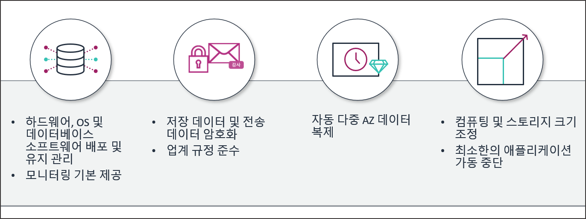
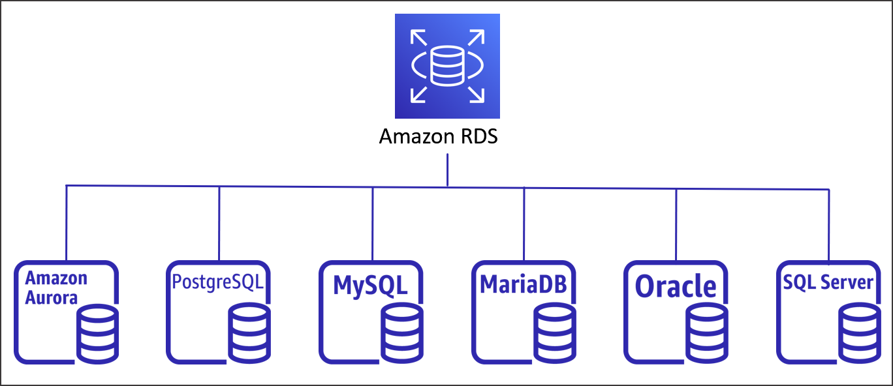

# AWS 데이터베이스 서비스 및 RDS 아키텍처

## 학습 목표
- AWS 관계형(SQL) 및 비관계형(NoSQL) 데이터베이스 서비스 유형별 특징 비교
- Amazon RDS 관리형 서비스 아키텍처, Multi-AZ 고가용성 및 읽기 전용 복제본(Read Replica) 원리 습득
- DB 파라미터 그룹을 활용한 타임존 및 utf8mb4 인코딩 설정법 파악
- RDS 자동 백업, 수동 스냅샷 및 특정 시점 복구(PITR) 동작 매커니즘 이해
- AWS 관리 콘솔을 활용한 RDS DB 인스턴스 생성 및 환경 구성 실습 완수

## 목차
- [1. AWS 데이터베이스 서비스 개요 및 유형 비교](#1-aws-데이터베이스-서비스-개요-및-유형-비교)
  - [1.1 SQL 및 NoSQL 데이터베이스 아키텍처 비교](#11-sql-및-nosql-데이터베이스-아키텍처-비교)
  - [1.2 관리형 데이터베이스와 비관리형 데이터베이스](#12-관리형-데이터베이스와-비관리형-데이터베이스)
- [2. Amazon Relational Database Service (Amazon RDS) 세부 아키텍처](#2-amazon-relational-database-service-amazon-rds-세부-아키텍처)
  - [2.1 Amazon RDS 핵심 기능 및 6대 데이터베이스 엔진](#21-amazon-rds-핵심-기능-및-6대-데이터베이스-엔진)
  - [2.2 Multi-AZ 고가용성 배포 및 자동 장애 조치](#22-multi-az-고가용성-배포-및-자동-장애-조치)
  - [2.3 읽기 전용 복제본 (Read Replica)을 통한 읽기 확장](#23-읽기-전용-복제본-read-replica을-통한-읽기-확장)
  - [2.4 DB 파라미터 그룹 및 옵션 그룹 설정](#24-db-파라미터-그룹-및-옵션-그룹-설정)
  - [2.5 RDS 백업, 스냅샷 및 특정 시점 복구 (PITR)](#25-rds-백업-스냅샷-및-특정-시점-복구-pitr)
  - [2.6 스토리지 타입 및 자동 확장 (Storage Auto Scaling)](#26-스토리지-타입-및-자동-확장-storage-auto-scaling)
- [3. AWS 관리 콘솔 기반 RDS 인스턴스 환경 구성](#3-aws-관리-콘솔-기반-rds-인스턴스-환경-구성)
  - [3.1 DB 파라미터 그룹 생성 및 한글/타임존 설정](#31-db-파라미터-그룹-생성-및-한글타임존-설정)
  - [3.2 RDS DB 인스턴스 프로비저닝 및 기본 구성](#32-rds-db-인스턴스-프로비저닝-및-기본-구성)
  - [3.3 데이터베이스 접속 엔드포인트 확인 및 초기 스키마 구성](#33-데이터베이스-접속-엔드포인트-확인-및-초기-스키마-구성)
- [4. 클라우드 네이티브 및 NoSQL 데이터베이스 서비스](#4-클라우드-네이티브-및-nosql-데이터베이스-서비스)
  - [4.1 Amazon Aurora 클라우드 전용 분산 데이터베이스](#41-amazon-aurora-클라우드-전용-분산-데이터베이스)
  - [4.2 Amazon DynamoDB 완전 관리형 키-값 NoSQL](#42-amazon-dynamodb-완전-관리형-키-값-nosql)
  - [4.3 Amazon ElastiCache 인메모리 데이터베이스](#43-amazon-elasticache-인메모리-데이터베이스)

---

# 1. AWS 데이터베이스 서비스 개요 및 유형 비교

## 1.1 SQL 및 NoSQL 데이터베이스 아키텍처 비교

### 1.1.1 관계형 데이터베이스 (SQL / RDBMS)
- 명확하게 정의된 스키마 [^1] (Schema) 구조와 테이블 간의 관계(Relationship)를 바탕으로 데이터를 관리하는 방식.
- 데이터의 엄격한 일관성과 무결성 보장을 위해 ACID [^2] (Atomicity, Consistency, Isolation, Durability) 트랜잭션 수용.
- 금융 거래, 주문 처리, 회원 관리 등 복잡한 Join 연산과 높은 데이터 정확도가 요구되는 시스템에 적합.

### 1.1.2 비관계형 데이터베이스 (NoSQL)
- 유연한 (Schema-less) 데이터 모델 구조를 지원하며, 수평적 스케일 아웃 (Scale-Out) 확장에 최적화된 데이터베이스.
- Key-Value, Document, Column-Family, Graph 등 다양한 데이터 저장 포맷 제공.
- 실시간 소셜 미디어, 게임 세션, 대규모 IoT 로그 수집 등 초고속 쓰기 및 가변적 데이터 구조 처리에 적합.


## 1.2 관리형 데이터베이스와 비관리형 데이터베이스

### 1.2.1 EC2 직접 구축 DB (비관리형 모델)
- EC2 가상 머신 내에 데이터베이스 엔진(MySQL, PostgreSQL 등)을 직접 설치하여 운용하는 방식.
- OS 설정부터 DB 커스터마이징까지 완전한 제어권을 보유하지만, 패치 적용, 백업 수립, 장애 복구, 고가용성 구성을 엔지니어가 직접 수행해야 함.

### 1.2.2 Amazon RDS 관리형 서비스 (관리형 모델)
- 데이터베이스의 프로비저닝, OS 및 DB 패치 작업, 자동 백업, 백업 보존, 백업 복구, 백업 덤프 [^3] (Data Dump) 등을 AWS가 자동 처리해 주는 관리형 서비스.
- 사용자는 데이터베이스 스키마 설계, 인덱스 최적화, SQL 쿼리 작성 등 순수 애플리케이션 개발 영역에 집중 가능.

---

# 2. Amazon Relational Database Service (Amazon RDS) 세부 아키텍처

## 2.1 Amazon RDS 핵심 기능 및 6대 데이터베이스 엔진

### 2.1.1 Amazon RDS 제공 기능
- 클라우드 환경에서 관계형 데이터베이스를 간편하게 설정, 운영 및 확장할 수 있도록 지원하는 인프라 서비스.
- 용량 변경, 백업 자동화, 특정 시점 복구, 컴퓨팅 스케일링 기능 기본 내장.



- 하드웨어, OS 및 DB 배포/유지 관리, 자동 모니터링 기본 제공
- 저장 데이터 및 전송 데이터 암호화를 통한 보안 및 업계 규정 준수
- 자동 다중 AZ 데이터 복제를 통한 고가용성 확보
- 컴퓨팅 및 스토리지 크기 조정 지원 및 최소한의 가동 중단

### 2.1.2 Amazon RDS 지원 6대 데이터베이스 엔진



- Amazon Aurora (AWS 클라우드 전용 분산 DB 엔진)
- PostgreSQL (고성능 엔터프라이즈 오픈소스 DB)
- MySQL (오픈소스 관계형 DB)
- MariaDB (MySQL 파생 오픈소스 DB)
- Oracle Database (상용 엔터프라이즈 DB)
- Microsoft SQL Server (상용 관계형 DB)

## 2.2 Multi-AZ 고가용성 배포 및 자동 장애 조치

### 2.2.1 동기식 복제 (Synchronous Replication)


- 주 데이터베이스 (Primary DB) 인스턴스가 위치한 가용 영역(AZ 1) 외에 다른 가용 영역(AZ 2)에 예비 데이터베이스 (Standby DB) 인스턴스를 동시에 배치.
- Primary DB에 쓰기 작업이 일어날 때마다 스토리지 계층에서 Standby DB로 데이터를 동기식으로 복제해서 데이터 동기화 유지.

### 2.2.2 자동 장애 조치 (Failover)


- 가용 영역 1의 Primary DB 인스턴스에 장애 발생 시, 가용 영역 2의 Standby DB 인스턴스가 Primary DB로 자동 승격(Promote)되어 서비스 연결 유지.
- 장애가 발생한 가용 영역 1 위치에는 새로운 대기(Standby) 인스턴스를 자동으로 생성하고 데이터 동기화 복제 재개.
- CNAME [^4] (Canonical Name) 기반의 동일한 엔드포인트 주소를 유지하면서 DNS 변경을 통해 트래픽을 Standby 인스턴스로 자동 전환.

## 2.3 읽기 전용 복제본 (Read Replica)을 통한 읽기 확장

### 2.3.1 비동기식 복제 (Asynchronous Replication)


- 애플리케이션 티어에서 쓰기 및 읽기 요청을 Primary DB 인스턴스로 처리하며, 트랜잭션 로그 기반의 비동기식 복제(Asynchronous Replication)를 수행.
- 주 데이터베이스의 트랜잭션 로그를 읽어와 읽기 전용 복제본 (Read Replica) 인스턴스로 비동기식 전송 처리.
- 읽기 트래픽(SELECT 쿼리)이 집중되는 웹 서비스에서 읽기 전용 엔드포인트를 별도로 분리하여 Primary DB의 연산 부하 경감.

### 2.3.2 수평적 스케일 아웃 확장
- 동일 리전 내에 최대 15개까지 읽기 전용 복제본을 생성하여 읽기 처리 성능을 다중 확장 가능.
- 필요시 읽기 전용 복제본을 독립된 승격(Promote) 인스턴스로 분리하여 별도 독자 DB로 운영 가능.

## 2.4 DB 파라미터 그룹 및 옵션 그룹 설정

### 2.4.1 DB 파라미터 그룹 (Parameter Group)
- 데이터베이스 엔진의 동작 세부 설정 변수(메모리 할당량, 최대 커넥션 수, 타임존, 문자 셋 인코딩 등)를 관리하는 파라미터 컨테이너.
- 주요 필수 변경 파라미터:
  - `time_zone`: `Asia/Seoul` (한국 표준시 KST 설정)
  - `character_set_server`: `utf8mb4` (이모지를 포함한 다국어 유니코드 지원)
  - `collation_server`: `utf8mb4_unicode_ci` (문자열 정렬 및 비교 규격)

### 2.4.2 파라미터 적용 방식의 구분
- 동적 파라미터 (Dynamic Parameter): 변경 즉시 DB 재부팅 없이 실시간 적용되는 변수.
- 정적 파라미터 (Static Parameter): 변경 후 반드시 DB 인스턴스를 재부팅해야만 유효 적용되는 변수.

## 2.5 RDS 백업, 스냅샷 및 특정 시점 복구 (PITR)

### 2.5.1 자동 백업 (Automatic Backup)
- 설정된 백업 윈도우 기간 동안 데이터베이스 전체 스토리지 상태 및 트랜잭션 로그를 Amazon S3에 자동으로 백업 보존.
- 백업 보존 기간은 1일부터 최대 35일까지 지정 가능.

### 2.5.2 수동 스냅샷 (Manual Snapshot)
- 사용자가 원하는 특정 시점에 직접 수동으로 생성하는 백업 이미지.
- DB 인스턴스를 삭제하더라도 사용자가 명시적으로 삭제하기 전까지 보존.

### 2.5.3 특정 시점 복구 (Point-in-Time Recovery, PITR)
- 자동 백업과 트랜잭션 로그를 결합하여 보존 기간 내 사용자가 원하는 특정 초 단위 시점으로 데이터베이스 복원.
- 복구 시 기존 DB를 덮어쓰지 않고 새로운 DB 엔드포인트를 가지는 신규 인스턴스로 복원 생성.

## 2.6 스토리지 타입 및 자동 확장 (Storage Auto Scaling)

### 2.6.1 gp2 vs gp3 스토리지 비교
- gp2: 용량(GB)에 비례하여 IOPS 성능 할당 (1GB당 3 IOPS).
- gp3: 차세대 범용 SSD로 용량 증가 없이 기본 3,000 IOPS 및 125 MiB/s 처리량을 독자적으로 추가 지정 가능하여 비용 효율 우수.

### 2.6.2 Storage Auto Scaling (스토리지 자동 확장)
- 잔여 저장 공간이 부족해지면 자동으로 스토리지를 증설하는 기능.
- 예측하지 못한 데이터 폭증 시 스토리지 꽉 참(Storage Full) 장애를 선제 방지.

---

# 3. AWS 관리 콘솔 기반 RDS 인스턴스 환경 구성

## 3.1 DB 파라미터 그룹 생성 및 한글/타임존 설정

1. AWS 콘솔 RDS 이동: AWS 관리 콘솔 접속 > [RDS] 서비스 이동
2. 파라미터 그룹 메뉴 이동: 좌측 탐색 창에서 [파라미터 그룹] 선택 > [파라미터 그룹 생성] 클릭
3. 파라미터 패밀리 지정:
   - 파라미터 그룹 패밀리: `mysql8.4` (또는 사용하는 DB 버전 패밀리)
   - 그룹 이름: `custom-mysql84-params`
   - 설명: `Timezone and UTF8mb4 settings`
4. 파라미터 값 편집: 생성된 파라미터 그룹 선택 > [편집] 클릭
   - `time_zone` 필터링 > 값: `Asia/Seoul` 선택
   - `character_set` 관련 모든 항목 > 값: `utf8mb4` 변경
   - `collation` 관련 모든 항목 > 값: `utf8mb4_unicode_ci` 변경
5. [변경 사항 저장] 클릭하여 파라미터 정의 완료

## 3.2 RDS DB 인스턴스 프로비저닝 및 기본 구성

1. 데이터베이스 생성 시작: RDS 콘솔 > 좌측 [데이터베이스] 메뉴 > [데이터베이스 생성] 클릭
2. 생성 방식 및 엔진 선택:
   - 데이터베이스 생성 방식: 표준 생성 (Standard Create)
   - 엔진 옵션: MySQL (또는 MariaDB)
   - 엔진 버전: MySQL 8.4 LTS
3. 템플릿 선택: 프리 티어 (Free Tier) 또는 개발/테스트 선택
4. 설정 (Settings):
   - DB 인스턴스 식별자: `board-db-rds`
   - 마스터 사용자 이름: `admin`
   - 마스터 암호 설정: `AdminPassword123!` (복잡도 만족 보안 비밀번호 입력)
5. 인스턴스 구성 (Instance Configuration):
   - DB 인스턴스 클래스: 버스트 가능 클래스 > `db.t4g.micro` 선택
6. 스토리지 (Storage):
   - 스토리지 타입: 범용 SSD (gp3)
   - 할당된 스토리지: `20` GiB
   - 스토리지 자동 설정: 체크 해제 (또는 최대 스토리지 임계값 100 GiB 지정)
7. 연결성 (Connectivity):
   - 퍼블릭 액세스: 예 (Publicly Accessible)
   - VPC 보안 그룹: 기존 선택 또는 신규 보안 그룹 지정
8. 추가 구성 (Additional Configuration):
   - 초기 데이터베이스 이름: `board_db`
   - DB 파라미터 그룹: 3.1 단계에서 생성한 `custom-mysql84-params` 선택
9. [데이터베이스 생성] 클릭하여 백그라운드 프로비저닝 진행 (약 5~10분 소요)

## 3.3 데이터베이스 접속 엔드포인트 확인 및 초기 스키마 구성

1. 엔드포인트 추출:
   - 데이터베이스 목록에서 `board-db-rds` 상태가 `상태: 사용 가능 (Available)`으로 변경된 것을 확인
   - 인스턴스 상세 탭 > [연결 및 보안] > 엔드포인트 (Endpoint) 주소 복사
   - 예시: `board-db-rds.xxxxxx.ap-northeast-2.rds.amazonaws.com`

2. 애플리케이션 전용 사용자 계정 및 권한 생성:
   - 로컬 CLI 또는 데이터베이스 클라이언트를 통해 RDS 엔드포인트로 마스터 접속 수행

```sql
-- 마스터 계정으로 RDS 접속 후 전용 애플리케이션 계정 생성
CREATE USER 'board_app'@'%' IDENTIFIED BY 'Board123!';

-- board_db 데이터베이스에 대한 전권 부여
GRANT ALL PRIVILEGES ON board_db.* TO 'board_app'@'%';

-- 권한 변경 사항 저장 적용
FLUSH PRIVILEGES;
```

---

# 4. 클라우드 네이티브 및 NoSQL 데이터베이스 서비스

## 4.1 Amazon Aurora 클라우드 전용 분산 데이터베이스

### 4.1.1 Amazon Aurora 아키텍처
- AWS가 클라우드 환경에 최적화하여 독자 개발한 엔터프라이즈급 관계형 데이터베이스.
- MySQL 및 PostgreSQL과 100% 호환되며, 표준 MySQL 대비 최대 5배, PostgreSQL 대비 최대 3배 빠른 처리 성능 제공.

### 4.1.2 6방향 데이터 분산 복제
- 3개 가용 영역(AZ)에 걸쳐 6개의 데이터 복제본을 독립된 분산 공유 스토리지 계층에 자동 이중화 저장.
- 쿼럼 [^5] (Quorum) 기반 합의 메커니즘을 적용하여 1개 AZ 전체에 장애가 발생하거나 최대 2개 복제본이 손실되어도 데이터 쓰기/읽기 지속 유지.

## 4.2 Amazon DynamoDB 완전 관리형 키-값 NoSQL

### 4.2.1 Amazon DynamoDB 개요
- 규모에 상관없이 10밀리초(ms) 미만의 극저 지연시간 성능을 보장하는 완전 관리형 Key-Value / Document NoSQL 데이터베이스 서비스.
- 서버리스 (Serverless) 형태로 운영되어 사용자가 인스턴스 규격을 관리하거나 프로비저닝할 필요 없이 요청 트래픽에 맞춰 수평 확장.

### 4.2.2 테이블 스케일링 및 데이터 파티셔닝
- 온디맨드 (On-Demand) 용량 모드 지원으로 스파이크 트래픽 발생 시 자동으로 분산 파티션 확장.
- 글로벌 테이블 (Global Tables) 기능을 활용하여 다중 리전 간 데이터 양방향 실시간 동기화 복제 제공.

## 4.3 Amazon ElastiCache 인메모리 데이터베이스

### 4.3.1 인메모리 캐싱 서비스
- Redis 및 Memcached 호환 오픈소스 인메모리 (In-Memory) 데이터 구조 저장소 서비스.
- 디스크 I/O 대신 마이크로초(us) 단위의 빠른 메모리 전용 읽기/쓰기 성능 제공.

### 4.3.2 캐시 어사이드 (Cache-Aside) 전략
- 자주 조회되는 핫 데이터(Hot Data)나 세션 정보, 랭킹 리더보드를 메모리에 주 캐시하여 RDBMS 데이터베이스 부하 차단.

---

[^1]: 스키마 (Schema): 데이터베이스 구조와 제약 조건에 관해 명시한 전반적인 데이터 정의 및 틀.
[^2]: ACID (Atomicity, Consistency, Isolation, Durability): 트랜잭션의 안전성을 보장하기 위해 데이터베이스 시스템이 충실히 지켜야 하는 원자성, 일관성, 격리성, 지속성 등 4가지 필수 특성.
[^3]: 데이터 덤프 (Data Dump): 데이터베이스 내부 테이블 데이터와 구조를 스크립트 파일 형태로 파일 시스템에 일괄 내보내거나 백업하는 행위.
[^4]: CNAME (Canonical Name): 도메인 이름 시스템(DNS)에서 하나의 호스트 이름을 다른 호스트 이름의 별칭으로 매핑하는 레코드 유형.
[^5]: 쿼럼 (Quorum): 분산 컴퓨팅 환경에서 데이터 판독 및 기록의 정확성을 보장하기 위해 합의에 필요한 최소한의 참여 노드 수.
